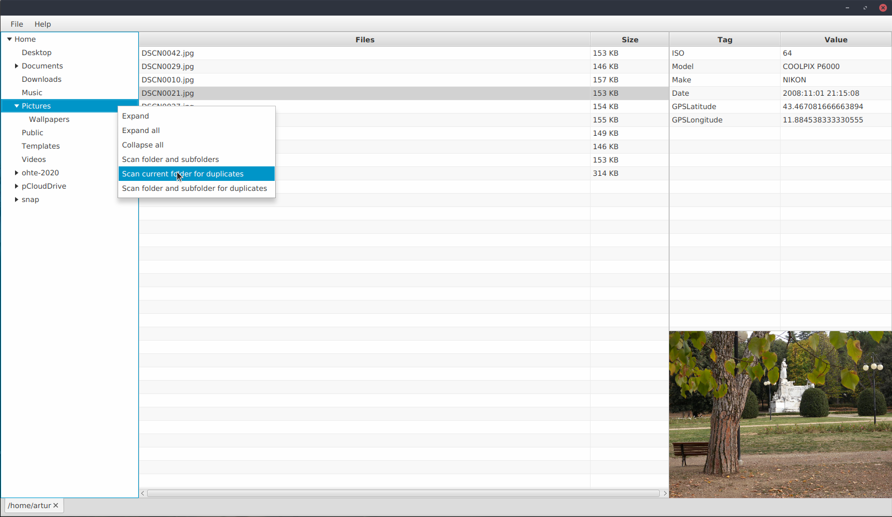

# DuplicatePhotoFinder

## Description

With this software users are able to scan for and manage duplicate photos.

_created for the Helsinki University's Software Development Methods 2020 course_

## Screenshot

## Documentation

[User Manual](https://github.com/shomarov/ohte-2020/blob/master/documentation/user_manual.md)

[Software Requirements](https://github.com/shomarov/ohte-2020/blob/master/documentation/requirements.md)

[Architecture Description](https://github.com/shomarov/ohte-2020/blob/master/documentation/architecture.md)

[Testing Documentation](https://github.com/shomarov/ohte-2020/blob/master/documentation/testing.md)

[Timekeeping](https://github.com/shomarov/ohte-2020/blob/master/documentation/timekeeping.md)

## Releases

[Week 3](https://github.com/shomarov/ohte-2020/releases/tag/v0.3)

[Week 4](https://github.com/shomarov/ohte-2020/releases/tag/v0.4)

[Week 5](https://github.com/shomarov/ohte-2020/releases/tag/v0.5)

[Week 6](https://github.com/shomarov/ohte-2020/releases/tag/v0.6)

[Final Release](https://github.com/shomarov/ohte-2020/releases/tag/v1.0)

## Command-Line Operations

**_Run all commands from the project root folder_**

### Running

Run:

    mvn compile exec:java -Dexec.mainClass=duplicatephotofinder.Main

### Generating executable jar file

Run:

    mvn package

generates executable jar-file to folder target

### Running executable jar file

Run:

    java -jar target/DuplicatePhotoFinder-1.0-SNAPSHOT.jar

### Testing

Tests are run with command:

    mvn test

Test coverage report is created with command:

    mvn jacoco:report

You can view the report by opening target/site/jacoco/index.html using your favorite browser

### JavaDoc

JavaDoc is generated with command:

    mvn javadoc:javadoc

JavaDoc can be viewed by opening target/site/apidocs/index.html in browser

### Checkstyle

Checks are run with command:

    mvn jxr:jxr checkstyle:checkstyle

Possible errors can be viewed by opening target/site/checkstyle.html in browser
