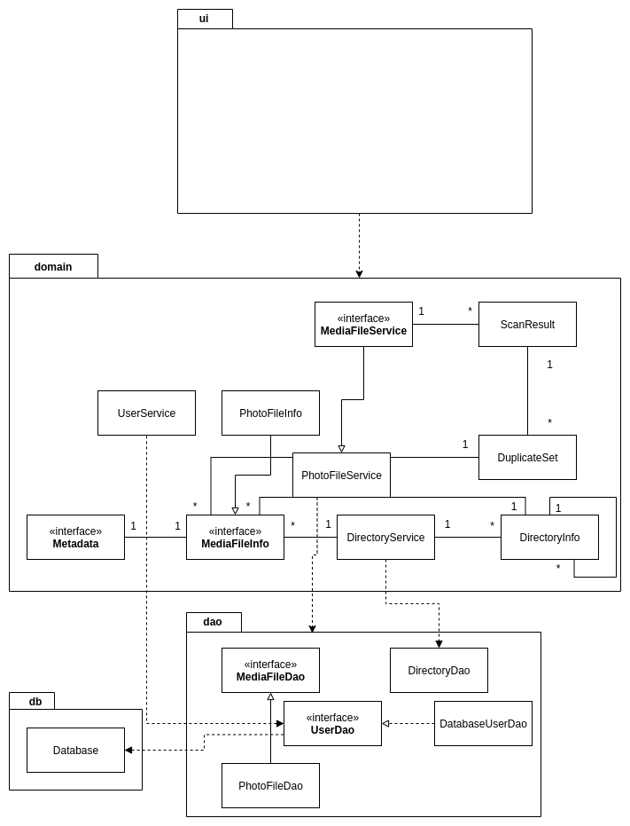

# Architecture Description

## Structure

The software's structure follows the basic three 3-tier architecture type and its package structure is following:

Package duplicatephotofinder.ui contains user interface implemented in JavaFX, duplicatephotofinder.domain contains the application logic and finally duplicatephotofinder.dao is responsible for reading from and writing data to the file system and database.

## User Interface

User interface consists of two views. First view (not yet implemented) is a login/register view, the second view is the main application view, which includes all the functions.

Each of those views are built as an independent Scene objects. The views are not viewabale simultaneously, as they are placed in the application's JavaFX Stage class one at a time.

UI is completely isolated from the application logic, it only calls appropriate methods of DirectoryService, PhotoFileService and UserService classes.

## Application Logic

At the moment the main parts of the application logic are classes:

### User

User class with username and password data.

### DirectoryInfo

Class that encapsulates information on the directory tree structure and the files they contain. Basically it is used to store the structure of the directory a user opens including subfolders. The UI then uses a DirectoryInfo object to populate the directory tree in the main view. Here is a demonstration of the process with the sequence diagram:

### DirectoryService

This class contains methods for interactions with directories on file system. Its constructor takes the DirectoryDao class as an injected dependency. It is used for interaction with file system's directory data.

### PhotoFileInfo

Class that encapsulates all essential information and metadata of a photo file. How it works:

1. The user scans a directory for photo files.
2. The PhotoFileService class then uses DirectoryDao to scan folder for files of type photo (provided DirectoryDao uses PhotoFileDao as MediaFileDao) and adds them to the DirectoryInfo object as a List.
3. DirectoryInfo now has all the fileinfos of the scanned folder
4. UI is able to show them with details

### PhotoMetadata

Class that encapsulates specific, deleloper defined metadata of a photo file. The final release of the software (1.0) contains the following tags:

1. Make
2. Model
3. Date
4. ISO
5. Shutter speed
6. Aperture
7. Brightness

8. GPS Latuture
9. GPS Longitude

### PhotoFileService

Class takes an implementation class of MediaFileDao interface as an injected dependency. It contains all the logic responsible for manipulating and interacting with photo data.

### DuplicateSet

Class that encapsulates a list of MediaFileInfo objects with the same md5 hash. It is used in the UI to populate the duplicate files list view.

## Data Persistence

Data persistence layer is encapsulated to duplicatephotofinder.dao package. It uses a DAO factory pattern to some extent.

### _Interfaces_

#### _MediaFileDao_

Interface to be used for interaction with different types of media files (image, video, pdf, etc...).

#### _UserDao_

Interface to be user for interaction with user account login data.

### Classes

#### DirectoryDao

Class which does not use the DAO factory pattern. It is a stand-alone class that deals with directories and file system.

#### PhotoFileDao

Implements MediaFileDao, class offers methods used for interaction with files of image type.

#### DatabaseUserDao

Data Access Object class for interacting with user data located in the database.
