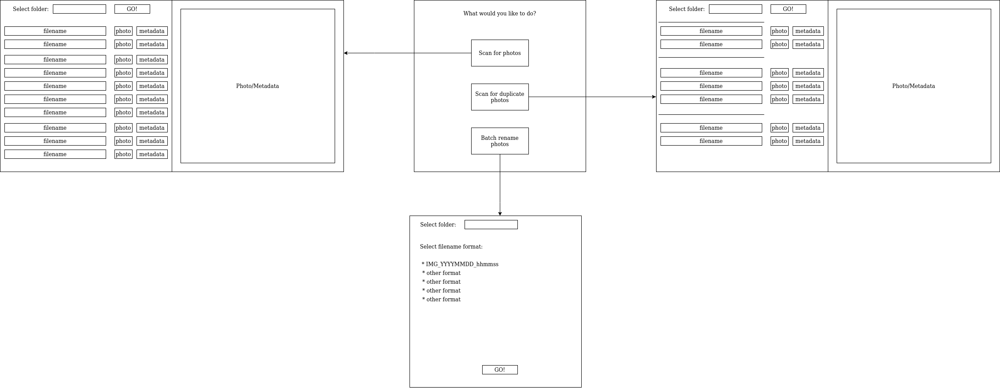

# Software requirements

## Overview

With this software users are able to scan for duplicate photos, batch rename photos, view and remove photo's metadata.

## Functionality

- user should be able to scan hard drive or folder for photos **_"done"_**
- user should be able to view the results of a scan **_"done"_**
- user should be able to scan hard drive or folder for duplicate photos **_"done"_**
- user should be able to view results of a duplicate photo scan **_"done"_**
- user should be able to delete selected photos **_"done on week 5"_**
- user should be able to view single photo's metadata **_"not quite done"_**
- user should be able to remove location data from selected photos
- user should be able to remove all metadata from selected photos
- user should be able to rename photos with selected filename format

## UI Draft

_Click for full sized image_

## Further development ideas

- edit metadata
- specify custom filename format for batch rename
- extend software to include other file formats
