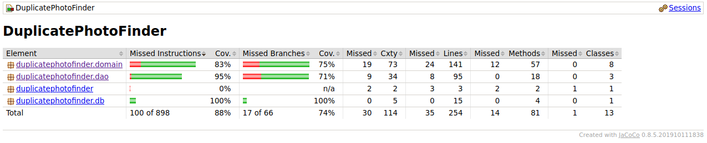

# Testing Documentation

The software has been tested with automatic unit tests and integration tests using JUnit framework. It has also been tested manually.

**_WARNING!_**

_The file structure of the src/test/resources/ folder was created specifically for testing purposes. Tests will not function correctly without test data. Do not tamper!_

## Unit and Integration Testing

### Application logic

Application logic has been tested with three different classes. DirectoryServiceTest has integration tests that are responsible for testing DirectoryService class, PhotoFileServiceTest has tests that are responsible for testing PhotoFileService class and UserServiceTest is responsible for testing UserService class.

UserServiceTest is using DatabaseUserDao class with a separate test database file. DirectoryService and PhotoFileServiceTest are using DirectoryDao and PhotoFileDao classes respectively.

### DAO-classes

DatabaseUserDaoTest is testing DatabaseUserDao with a separate database for testing purposes. PhotoFileDaoTest is is testing PhotoFileDao and its ability to read photo files and photo metadata.

## System Testing

The software was tested manually on Ubuntu Linux and Cubbli Linux by downloading, installing and trying out all the functions.
